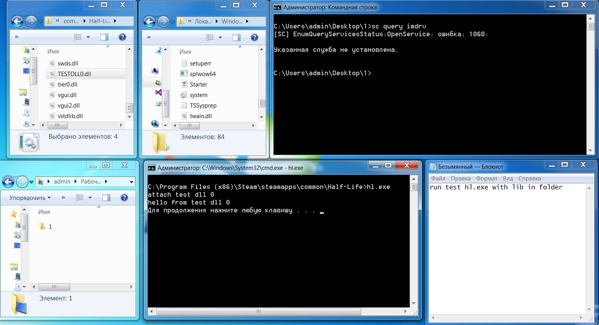
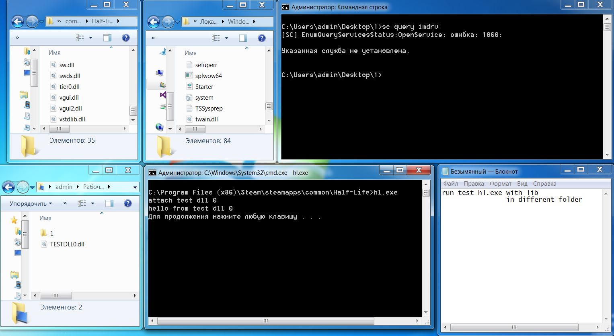
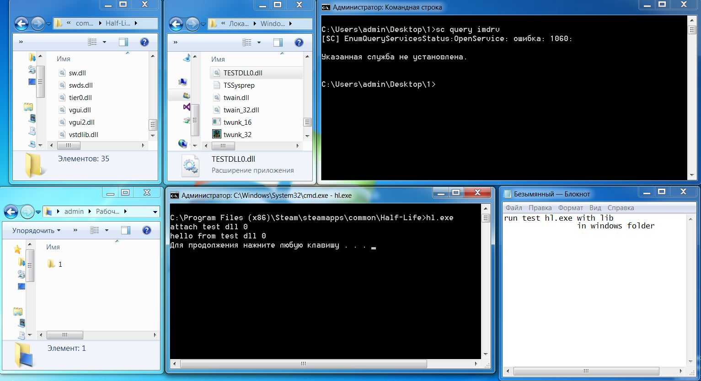
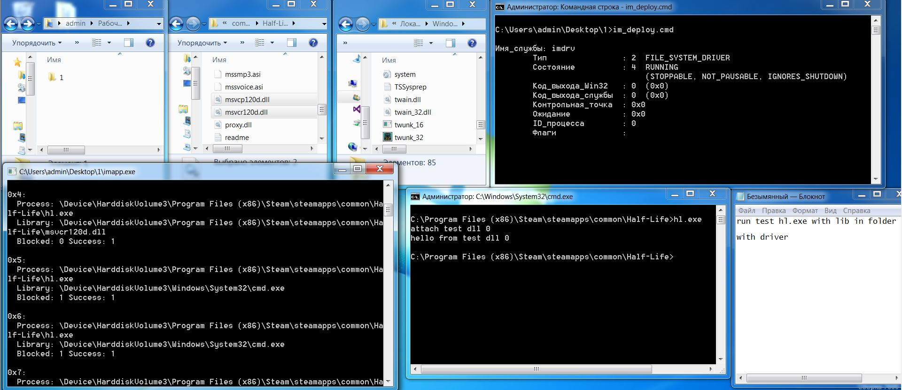
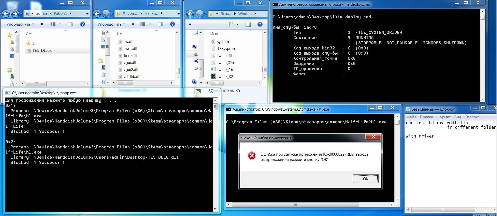
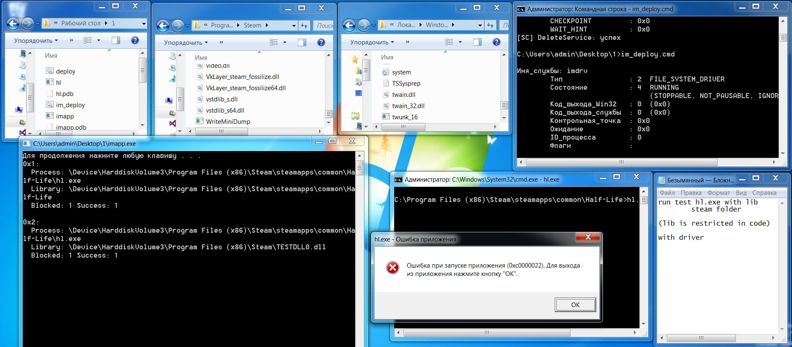

# Injector monitor file system minifilter driver

### imdrv.sys

Driver registered on IRP_MJ_CREATE. Driver checks SecurityContext on pre create callback in case of FILE_EXECUTE, it proceeds to post create. Driver collects process name of the caller using ZwQueryInformationProcess. In case if process name equals to hardcoded names driver collects file name (file that this process tries to open with execute rights). In case if file satisfies requirements driver just log information, otherwise cancel this IRP with ACCESS_DENIED error and log information.

### imlib.lib

Library provides communication with driver to callect logs.

### imapp.exe

User mode app just an example of usage of the library.

### testapp and testdll

Tests are simple helloworld examples to test library load.

## Build

1. Install visual studio 2013 update 4, WDK 8.1
2. Add path to msbuild (for example: C:\Program Files (x86)\MSBuild\12.0\Bin\amd64) to path environment variable
3. run im_build.cmd (it requires 3 parameters: path to VM, snapshot name, path to shared with vm folder). Change this script if you use other virtual machine than vmware.
4. binaries is in build directory and copied to share folder

## Deploy

To deploy driver and application run im_build.cmd in virtual machine

## Further development:

1. Do not hardcode requirements of accepting or declining (need to recieve them via IOCTL) or other way
2. Implement dll-injector to test on injections

## Demo screenshots:

Running test application with test library placed in the same folder without running driver

Running test application with test library placed in some different folder (this folder was added to PATH system variable) without running driver

Running test application with test library placed in Windows directory without running driver

Running test application with test library placed in the same folder with running driver

Running test application with test library placed in some different folder (this folder was added to PATH system variable) with running driver

Running test application with test library placed in Windows directory with running driver

Running test application with restricted library with running driver

---------------------------------------
Tested on Windows 7 x64